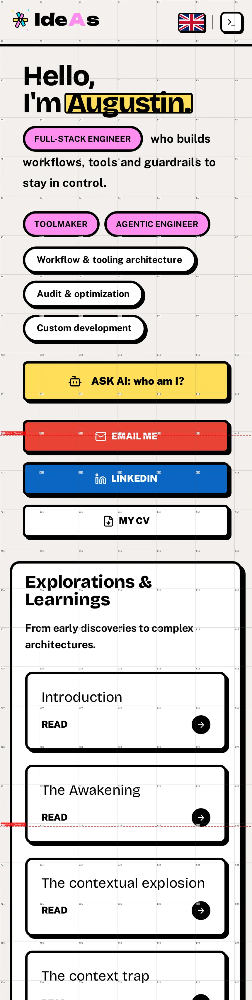

# VEX

VEX is a viewport fold inspector for web pages.

It helps answer a practical layout question: **where does each device cut the page, and does that cut break the experience?**

Many responsive pages look fine in a full-page screenshot but feel wrong on a real device: a button is sliced by the fold, a heading lands half-visible, a CTA starts just below the first screen, or a sticky header changes the rhythm while scrolling. VEX captures the page across device presets and draws the viewport cuts directly onto the screenshot, so those layout problems become visible.

| Fold markers | Grid overlay |
| --- | --- |
|  |  |

## What VEX Is For

Use VEX when you want to tune a layout for real viewport boundaries:

- check whether important buttons, cards, headings, or forms are cut by a device fold;
- compare the same page on desktop, tablet, small phone, and large phone presets;
- inspect how sticky headers or fixed bars affect later screen cuts;
- keep a portable visual record of what each device saw;
- give a reviewer or agent exact visual evidence instead of a vague screenshot.

The current strongest workflow is **capture-only**: no model call, just reliable screenshots, fold lines, grids, DOM snapshots, and audit metadata.

## Quick Start

Install dependencies:

```bash
bun install
```

Create a config:

```bash
cp vex.config.example.ts vex.config.ts
```

Add a capture preset:

```typescript
import { defineConfig } from "./src/config/index.js";

export default defineConfig({
  outputDir: "vex-output",
  scanPresets: {
    folds: {
      urls: ["https://example.com"],
      devices: ["desktop-1920", "iphone-14-pro-max"],
      mode: "capture-only",
      foldOcclusion: true,
    },
  },
});
```

Run it:

```bash
bun src/cli/index.ts scan --preset folds
```

Open the generated audit folder and start with:

- `03-with-folds.png` - red lines show where each viewport cut lands.
- `04-with-grid.png` - grid overlay makes visual regions easy to reference.
- `01-screenshot-viewport-metrics.json` - measured viewport and fold data.

## What You Get

Each scan creates one audit folder with one page/device folder per capture.

| Artifact | Why it matters |
| --- | --- |
| `01-screenshot.png` | Clean full-page page capture. |
| `03-with-folds.png` | Shows whether the viewport cuts through important UI. |
| `04-with-grid.png` | Lets humans and agents point to exact visual regions. |
| `01-screenshot-viewport-metrics.json` | Explains viewport size, DPR, safe-area values, and sticky/fixed fold occlusion. |
| `02-dom.json` | Keeps DOM context available for later analysis or locating. |
| `state.json` / `audit.json` | Records what VEX ran and what it produced. |

## AI Direction

VEX is moving toward AI-assisted visual review, but the AI layer is not the core truth source.

The intended direction is:

1. VEX captures deterministic visual evidence.
2. Humans inspect the fold and grid artifacts.
3. AI can later help flag suspicious cuts: sliced CTAs, awkward text breaks, broken rhythm, or responsive regressions.
4. The screenshot remains the evidence.

For now, treat AI analysis as optional and experimental. The capture workflow is the baseline.

## Documentation

- [Getting Started](docs/GETTING-STARTED.md)
- [Capture-Only Workflow](docs/CAPTURE-ONLY.md)
- [Reading Audit Output](docs/READING-AUDIT-OUTPUT.md)
- [Mobile Captures](docs/MOBILE-CAPTURES.md)
- [AI Analysis](docs/AI-ANALYSIS.md)
- [Technical Docs Map](docs/TECHNICAL-DOCS.md)

Technical architecture and development guidance live in [AI.md](AI.md).

## Status

Private, early product. The capture and fold-review workflows are the most exercised parts today. AI analysis and repair loops are product direction, not the primary validated workflow yet.
